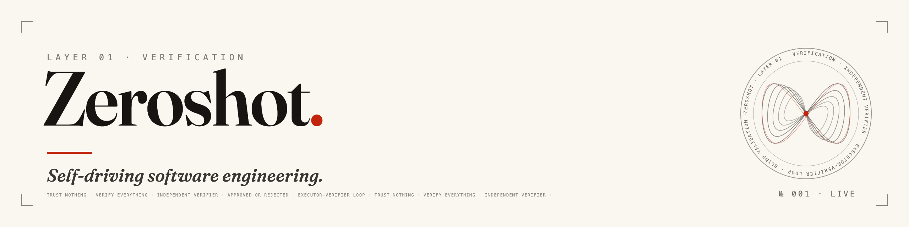

<div align="center">

<picture>
  <source media="(prefers-color-scheme: dark)" srcset="docs/brand/zeroshot-hero-dark.png">
  
</picture>

&nbsp;

<a href="https://theopenengine.com"><picture><source media="(prefers-color-scheme: dark)" srcset="docs/brand/social/website-dark.png"></picture></a>
<a href="https://x.com/OpenEngineCo"><picture><source media="(prefers-color-scheme: dark)" srcset="docs/brand/social/x-dark.png"></picture></a>
<a href="https://www.linkedin.com/company/the-open-engine-company"><picture><source media="(prefers-color-scheme: dark)" srcset="docs/brand/social/linkedin-dark.png"></picture></a>
<a href="https://discord.gg/fZyzf2Cut9"><picture><source media="(prefers-color-scheme: dark)" srcset="docs/brand/social/discord-dark.png"></picture></a>

[](https://www.npmjs.com/package/@the-open-engine/zeroshot)
[](https://github.com/the-open-engine/zeroshot/actions/workflows/ci.yml)
[](LICENSE)
[](#install)
[](#install)
[](https://github.com/the-open-engine/zeroshot)
[](#the-open-engine)

</div>

**The agent that wrote the code shouldn't be the one that says it works.**

Zeroshot is an open-source, multi-agent orchestration engine for autonomous software engineering. It drives a coding agent you already run (Claude Code, OpenAI Codex, Gemini CLI, or OpenCode) through an **executor-verifier loop**: an agent writes the change, then an _independent_ verifier that never saw how it was made approves it, or hands back a reproducible failure. The loop runs until the change is verified.

## Install

<!-- install-placeholder -->

```bash
npm install -g @the-open-engine/zeroshot
```

Requires **Node ≥ 18** and at least one provider CLI (Claude Code, Codex, Gemini, or OpenCode). Linux and macOS today; Windows is deferred.

<div align="center">
  
  <br>
  <em>One run, unattended. 100× speed · 90-minute run · 5 iterations to approval.</em>
</div>

## How it works

Zeroshot separates the agent that **writes** the code from the agent that **judges** it.

A conductor sizes the workflow to the task. An executor (an AI coding agent) implements the change in an isolated workspace (git worktree or Docker). Then an **independent verifier** inspects the result without ever seeing the executor's context or history, so it cannot approve its own reasoning. The verifier returns `APPROVED`, or `REJECTED` with an actionable, reproducible failure, and the loop repeats until the change is verified or hands back a concrete reason it isn't. Every step is written to a crash-safe SQLite ledger, so a run survives a reboot and resumes where it stopped.

```text
task --> plan --> implement --> verify --> APPROVED --> done
                      ^            |
                      +- REJECTED -+   (reproducible failure)
```

Bring your own provider and your own backend. Zeroshot orchestrates the agents that write your code; it doesn't store your keys or replace your models.

## How is this different from a single coding agent?

|                             | A single coding agent        | Zeroshot                                                                                    |
| --------------------------- | ---------------------------- | ------------------------------------------------------------------------------------------- |
| Who says it is correct?     | the same agent that wrote it | a separate agent that never saw how it was written                                          |
| Is the code actually run?   | usually just claimed         | executed against your real tests                                                            |
| When it fails, you get      | an assertion it is fine      | a reproducible failure                                                                      |
| When does it stop?          | when it decides it is done   | when the change is verified, or provably is not                                             |
| Which coding agent runs it? | one, fixed                   | any you already run: Zeroshot is the harness around Claude Code, Codex, Gemini, or OpenCode |

## Quick start

```bash
zeroshot run 123                 # a GitHub issue number
zeroshot run feature.md          # a markdown spec
zeroshot run "Add a --json flag" # inline text
```

Describe a non-trivial task inline and let the loop run it to a verified change:

```bash
zeroshot run "Add optimistic locking with automatic retry: when updating a user,
retry with exponential backoff up to 3 times, merge non-conflicting field changes,
and surface conflicts with details. Handle the ABA problem where version goes A->B->A."
```

<details>
<summary><strong>Command reference</strong></summary>

```bash
# Run
zeroshot run <input>            # issue number / URL / key / markdown file / inline text
zeroshot run 123 --worktree     # isolate in a git worktree
zeroshot run 123 --docker       # isolate in a container
zeroshot run 123 --pr           # worktree + open a pull request
zeroshot run 123 --ship         # worktree + PR + auto-merge on approval
zeroshot run 123 -d             # background (daemon)
zeroshot run 123 --provider gemini   # override the provider for this run

# Monitor & manage
zeroshot list                   # all clusters (--json)
zeroshot status <id>            # cluster details
zeroshot logs <id> -f           # stream logs
zeroshot resume <id> [prompt]   # resume a stopped/failed run
zeroshot stop <id>              # graceful stop
zeroshot kill <id>              # force kill
zeroshot export <id>            # export the conversation

# Library & config
zeroshot providers              # list providers / set-default / setup
zeroshot agents list            # available agents (agents show <name>)
zeroshot settings               # view / get / set settings
zeroshot cmdproof check <id>    # reuse a verified command result
```

</details>

## Providers and backends

Zeroshot shells out to provider CLIs; it stores no API keys and manages no auth. Pick a default and override per run.

| Provider     | CLI                                    |
| ------------ | -------------------------------------- |
| Claude Code  | `npm i -g @anthropic-ai/claude-code`   |
| OpenAI Codex | `npm i -g @openai/codex`               |
| Gemini CLI   | `npm i -g @google/gemini-cli`          |
| OpenCode     | see [opencode.ai](https://opencode.ai) |

```bash
zeroshot providers                    # see what's installed
zeroshot providers set-default codex
zeroshot run 123 --provider gemini
```

Issue backends are **auto-detected from your git remote**: **GitHub, GitLab, Jira, and Azure DevOps**. Paste a number, key, or URL:

```bash
zeroshot run 123                                              # GitHub
zeroshot run https://gitlab.com/org/repo/-/issues/456        # GitLab
zeroshot run PROJ-789                                         # Jira
zeroshot run https://dev.azure.com/org/project/_workitems/edit/999  # Azure DevOps
```

Each backend needs its own CLI installed (`gh`, `glab`, `jira`, or `az`). See [`docs/providers.md`](docs/providers.md) for model levels and setup.

## Isolation

By default, agents modify files only; they do **not** commit or push. Opt into isolation to let the loop own a branch (the flags cascade: `--ship` → `--pr` → `--worktree`).

| Mode         | Flag         | Use when                                         |
| ------------ | ------------ | ------------------------------------------------ |
| None         | _(default)_  | quick task, you review the changes yourself      |
| Git worktree | `--worktree` | PR workflows, lightweight branch isolation       |
| Docker       | `--docker`   | risky experiments, parallel runs, full isolation |

<details>
<summary><strong>Docker credential mounts</strong></summary>

When using `--docker`, Zeroshot mounts credential directories so agents can reach provider CLIs and tools. Defaults: `gh`, `git`, `ssh`. Presets include `aws`, `azure`, `kube`, `terraform`, `gcloud`, and the provider configs.

```bash
zeroshot settings set dockerMounts '["gh","git","ssh","aws"]'
zeroshot run 123 --docker --mount ~/.aws:/root/.aws:ro
zeroshot run 123 --docker --no-mounts
```

See [`docs/providers.md`](docs/providers.md) for mount details.

</details>

## Scope and status

Zeroshot performs best when a task has **clear acceptance criteria**. If you can't say what "done" means, an independent verifier can't confirm it.

| Task                                            | Good fit? | Why                     |
| ----------------------------------------------- | --------- | ----------------------- |
| Add rate limiting (sliding window, per-IP, 429) | Yes       | clear requirements      |
| Refactor auth to JWT                            | Yes       | defined end state       |
| Fix a login bug                                 | Yes       | success is measurable   |
| "Make the app faster"                           | No        | needs exploration first |
| "Improve the codebase"                          | No        | no acceptance criteria  |

- **Pre-1.0 in spirit.** Interfaces still move between releases; pin your version. (The npm version auto-increments on every merge, so read it as a build counter, not a stability promise.)
- **Crash-safe.** All state persists to a SQLite ledger; `zeroshot resume <id>` continues at any time.
- **No TUI in this release.** Monitor with `zeroshot logs <id> -f`, `zeroshot list`, and `zeroshot status <id>`.

<details>
<summary><strong>Architecture, quality gates and command proofs</strong></summary>

Zeroshot is a message-driven coordination layer: a conductor classifies each task by complexity and type, a workflow template selects agents and validators, agents publish results to a SQLite ledger, and validators approve or reject with specific findings.

- **Required handoff quality gates**: in `--pr`/`--ship` flows, the git-pusher fails closed until every configured gate has fresh passing evidence.
- **Cmdproof**: make expensive exact commands reusable across agents with `zeroshot cmdproof check <id>`.

See [CLAUDE.md](./CLAUDE.md) for the cluster schema, primitives, and the conductor's classification model.

</details>

## The Open Engine

Zeroshot is **Layer 01 · Verification** of [The Open Engine](https://theopenengine.com), the open stack for autonomous software production. Generating code is easy; trusting it is not. The engine is layered because trust is layered:

|        | Layer                      | Status                      |
| ------ | -------------------------- | --------------------------- |
| **01** | **Verification: Zeroshot** | This repo · open · shipping |
| 02     | Constraints: **Opcore**    | Sibling · alpha             |
| 03-05  | Intent · Context · Runtime | In development              |

Zeroshot runs the loop: an agent writes the change, and an **independent** verifier decides whether it holds: approve, or a reproducible failure. **Opcore** is the sibling layer, a deterministic, local, read-only **constraints** gate for coding agents (currently private alpha `0.1.0-alpha.0`, built in the open, not yet published). Verification asks _"does this meet the goal?"_; constraints ask _"is this within tolerance?"_

Each layer ships the same way: extracted from the platform we run, then opened. **Trust nothing. Verify everything.**

## Contributing

See [CONTRIBUTING.md](CONTRIBUTING.md) for development setup, [CODE_OF_CONDUCT.md](CODE_OF_CONDUCT.md) before participating, and [SECURITY.md](SECURITY.md) for security reports. More in [`docs/`](docs/) and [CLAUDE.md](./CLAUDE.md).

<!-- discord-placeholder -->

Questions and help: [Discord](https://discord.gg/fZyzf2Cut9).

## License

MIT. [The Open Engine Company](https://github.com/the-open-engine).
