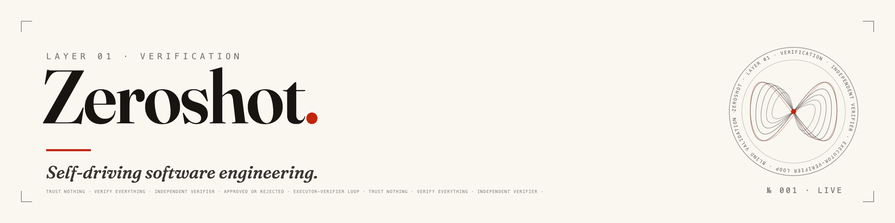
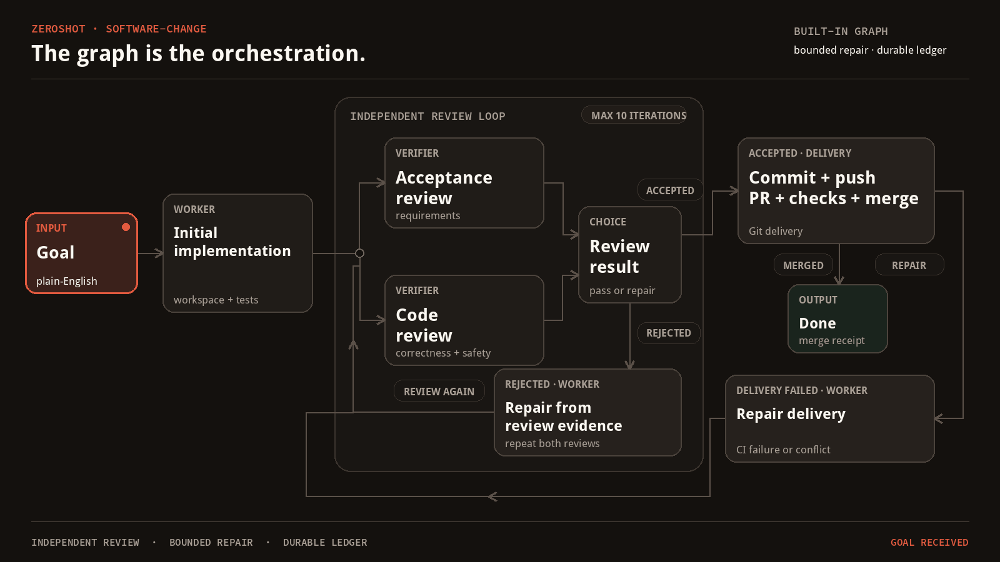

<div align="center">

<picture>
  <source media="(prefers-color-scheme: dark)" srcset="docs/brand/zeroshot-hero-dark.png">
  
</picture>

&nbsp;

<a href="https://theopenengine.com"><picture><source media="(prefers-color-scheme: dark)" srcset="docs/brand/social/website-dark.png"></picture></a>
<a href="https://x.com/OpenEngineCo"><picture><source media="(prefers-color-scheme: dark)" srcset="docs/brand/social/x-dark.png"></picture></a>
<a href="https://www.linkedin.com/company/the-open-engine-company"><picture><source media="(prefers-color-scheme: dark)" srcset="docs/brand/social/linkedin-dark.png"></picture></a>
<a href="https://discord.gg/fZyzf2Cut9"><picture><source media="(prefers-color-scheme: dark)" srcset="docs/brand/social/discord-dark.png"></picture></a>

[](https://www.npmjs.com/package/@the-open-engine/zeroshot)
[](https://github.com/the-open-engine/zeroshot/actions/workflows/ci.yml)
[](LICENSE)
[](#install)
[](#install)
[](https://github.com/the-open-engine/zeroshot)
[](#the-open-engine)

</div>

**The agent that wrote the code shouldn't be the one that says it works.**

Zeroshot is an open-source, multi-agent orchestration engine for autonomous software engineering. It drives a coding agent you already run (Claude Code, Codex, Copilot, Gemini, and others) through an **executor-verifier loop sized to the task**: an agent writes the change, then verifiers that didn't write it approve the result, or reject it and say exactly what's wrong. The loop runs until the change is verified.

Underneath, it's a general graph engine: you define the agents and how they hand off, and the runtime executes that wiring the same way every time, with no model deciding what runs next. The executor-verifier loop is the graph it ships with, not the only one it can run.

<div align="center">
  <picture>
    <source media="(prefers-color-scheme: dark)" srcset="docs/assets/zeroshot-architecture-dark.webp">
    
  </picture>
  <br>
  <em>One run, drawn as it happens. A conductor scores the issue, escalates what it can't call, the router sizes the cluster, and the change is rejected once before it is approved.</em>
</div>

## Install

<!-- install-placeholder -->

```bash
npm install -g @the-open-engine/zeroshot
```

Requires **Node ≥ 18** and a coding agent for it to drive: one of the [eight supported CLIs](#providers-and-backends), or any OpenAI- or Anthropic-compatible endpoint. Linux and macOS today; Windows is deferred.

<div align="center">
  
  <br>
  <em>And here it is actually running. Unattended, 100× speed · 90-minute run · 5 iterations to approval.</em>
</div>

## How it works

Zeroshot separates the agent that **writes** the code from the agent that **judges** it.

An executor makes the change. By default it edits your files in place; `--worktree` or `--docker` moves it somewhere isolated first.

Validators then inspect what came out. They don't share the executor's session and never receive its progress log, because every agent declares up front which messages reach it, which makes the isolation a property of the wiring rather than a rule that has to hold. A validator sees the issue, the plan, and the executor's own summary of what it did.

Each returns `APPROVED`, or `REJECTED` with the objections that blocked it, and one rejection is enough to send the work back. Every validator is instructed to run something and capture the output rather than read the diff and form a view. Every message lands in a SQLite ledger as it happens, so a run survives a reboot and `zeroshot resume <id>` picks it up where it stopped.

A conductor classifies the task before any of that runs, and its verdict decides how many validators show up and in what arrangement. A one-file mechanical change doesn't get the same treatment as a payment-processing change, and debugging has a shape of its own; the [routing table](#classification-and-routing) has the specifics. That whole arrangement is a JSON graph config, and you can write your own.

Bring your own provider and your own backend. Zeroshot orchestrates the agents that write your code; it doesn't hold your provider credentials or replace your models.

## How is this different from a single coding agent?

|                             | A single coding agent        | Zeroshot                                                                               |
| --------------------------- | ---------------------------- | -------------------------------------------------------------------------------------- |
| Who says it is correct?     | the same agent that wrote it | agents that didn't write it and never saw it working                                   |
| Is the code actually run?   | usually just claimed         | executed against your real tests                                                       |
| When it fails, you get      | an assertion it is fine      | exactly what's wrong                                                                   |
| When does it stop?          | when it decides it is done   | when the change is verified, or provably is not                                        |
| Which coding agent runs it? | one, fixed                   | any you already run: eight agent CLIs, or any OpenAI- or Anthropic-compatible endpoint |

One exception, stated plainly: a task the conductor classifies as TRIVIAL runs a single worker with no validator. For TASK and DEBUG runs, `--pr` or `--ship` adds one; TRIVIAL INQUIRY runs remain single-worker. See [classification and routing](#classification-and-routing).

## Quick start

```bash
zeroshot run 123                 # an issue number, resolved from your git remote
zeroshot run feature.md          # a markdown spec
zeroshot run "Add a --json flag" # inline text
```

Describe a non-trivial task inline and let the loop run it to a verified change:

```bash
zeroshot run "Add optimistic locking with automatic retry: when updating a user,
retry with exponential backoff up to 3 times, merge non-conflicting field changes,
and surface conflicts with details. Handle the ABA problem where version goes A->B->A."
```

<details>
<summary><strong>Command reference</strong></summary>

```bash
# Run
zeroshot run <input>            # issue number / URL / key / markdown file / inline text
zeroshot run 123 --worktree     # isolate in a git worktree
zeroshot run 123 --docker       # isolate in a container
zeroshot run 123 --pr           # worktree + open a pull request
zeroshot run 123 --ship         # worktree + PR + auto-merge on approval
zeroshot run 123 -d             # background (daemon)
zeroshot run 123 --provider gemini   # override the provider for this run
zeroshot run 123 --config ./mine.json  # run your own workflow graph

# Monitor & manage
zeroshot list                   # all clusters (--json)
zeroshot status <id>            # cluster details
zeroshot logs <id> -f           # stream logs
zeroshot resume <id> [prompt]   # resume a stopped/failed run
zeroshot stop <id>              # graceful stop
zeroshot kill <id>              # force kill
zeroshot export <id>            # export the conversation

# Library & config
zeroshot providers              # list providers / set-default / setup
zeroshot agents list            # available agents (agents show <name>)
zeroshot config list            # workflow graphs (config show / validate)
zeroshot settings               # view / get / set settings
zeroshot cmdproof check <id>    # reuse a verified command result
```

</details>

## Providers and backends

Zeroshot shells out to provider CLIs, so provider auth stays wherever you already set it up and Zeroshot never handles those credentials. Pick a default and override per run.

| Provider       | CLI                                                                |
| -------------- | ------------------------------------------------------------------ |
| Claude Code    | `npm i -g @anthropic-ai/claude-code`                               |
| OpenAI Codex   | `npm i -g @openai/codex`                                           |
| Gemini CLI     | `npm i -g @google/gemini-cli`                                      |
| GitHub Copilot | `npm i -g @github/copilot`                                         |
| OpenCode       | see [opencode.ai](https://opencode.ai)                             |
| Kiro           | see [kiro.dev](https://kiro.dev/docs/cli/)                         |
| OMP            | `npm i -g --ignore-scripts @oh-my-pi/pi-coding-agent`              |
| Pi             | `npm i -g --ignore-scripts @earendil-works/pi-coding-agent@0.80.3` |

```bash
zeroshot providers                    # see what's installed
zeroshot providers set-default codex
zeroshot run 123 --provider gemini
```

`gateway` isn't a CLI. It speaks the OpenAI or Anthropic wire protocol against any `baseUrl`, so Zeroshot can drive a self-hosted model, a proxy, or a router without a coding-agent CLI installed at all. It's also the one provider whose key Zeroshot holds, in settings rather than in someone else's config:

```bash
zeroshot settings set providerSettings.gateway.baseUrl https://your-endpoint/v1
zeroshot settings set providerSettings.gateway.apiKey sk-...
zeroshot run 123 --provider gateway
```

Five issue backends are detected for you: **GitHub, GitLab, Azure DevOps, Jira, and Linear**. Paste a number, key, or URL:

```bash
zeroshot run 123                                              # from your git remote
zeroshot run https://gitlab.com/org/repo/-/issues/456        # GitLab
zeroshot run https://dev.azure.com/org/project/_workitems/edit/999  # Azure DevOps
zeroshot run PROJ-789                                         # Jira
zeroshot run ENG-42 --linear                                  # Linear
```

The first three come from your git remote. Jira and Linear are recognised by their `KEY-NUMBER` shape, which is ambiguous between them: Linear takes it when Linear is configured and Jira isn't, and `--jira` or `--linear` settles it either way.

`gh`, `glab`, `jira` and `az` each need installing for their backend. Linear needs no CLI because it calls the Linear GraphQL API directly, which makes it the one backend that wants a key of its own:

```bash
zeroshot settings set linearApiKey lin_api_...   # or export LINEAR_API_KEY
```

See [`docs/providers.md`](docs/providers.md) for model levels and setup.

## Isolation

By default, agents modify files only; they do **not** commit or push. Opt into isolation to let the loop own a branch (the flags cascade: `--ship` → `--pr` → `--worktree`).

| Mode         | Flag         | Use when                                         |
| ------------ | ------------ | ------------------------------------------------ |
| None         | _(default)_  | quick task, you review the changes yourself      |
| Git worktree | `--worktree` | PR workflows, lightweight branch isolation       |
| Docker       | `--docker`   | risky experiments, parallel runs, full isolation |

<details>
<summary><strong>Docker credential mounts</strong></summary>

When using `--docker`, Zeroshot mounts credential directories so agents can reach provider CLIs and tools. Defaults: `gh`, `git`, `ssh`. Presets include `aws`, `azure`, `kube`, `terraform`, `gcloud`, and the provider configs.

```bash
zeroshot settings set dockerMounts '["gh","git","ssh","aws"]'
zeroshot run 123 --docker --mount ~/.aws:/root/.aws:ro
zeroshot run 123 --docker --no-mounts
```

See [`docs/providers.md`](docs/providers.md) for mount details.

</details>

## Classification and routing

Before any code gets written, a conductor scores the task on two axes and routes it to a workflow. It reads complexity as one of TRIVIAL, SIMPLE, STANDARD or CRITICAL, plus a task type of INQUIRY, TASK or DEBUG. A junior model does this pass cheaply; when it can't call it, it answers UNCERTAIN and a senior model makes the decision instead.

What you get depends on that score:

| Classification                       | Workflow           | Agents                                                        |
| ------------------------------------ | ------------------ | ------------------------------------------------------------- |
| TRIVIAL                              | `single-worker`    | worker only, **no validator**                                 |
| TRIVIAL INQUIRY + `--pr`/`--ship`    | `single-worker`    | worker only, **no validator**                                 |
| TRIVIAL TASK/DEBUG + `--pr`/`--ship` | `worker-validator` | worker, 1 validator                                           |
| SIMPLE                               | `worker-validator` | worker, 1 validator                                           |
| STANDARD                             | `full-workflow`    | planner, worker, 2 validators                                 |
| CRITICAL                             | `full-workflow`    | planner, worker, meta-coordinator, 4 validators in two stages |
| DEBUG (non-TRIVIAL)                  | `debug-workflow`   | investigator, fixer, tester, completion-detector              |

Two things worth knowing before you rely on it. TRIVIAL skips validation entirely on the default path, which is the point of calling it trivial, but it does mean the executor-verifier split doesn't apply there. For TASK and DEBUG runs, `--pr` and `--ship` add a validator back; TRIVIAL INQUIRY stays single-worker in every mode. And debugging isn't the same shape as building at all, since an investigator finds the fault before a fixer touches anything.

CRITICAL is deliberately rare. The conductor is told to bias toward STANDARD when it's torn, because a CRITICAL run costs a senior model and four validators.

## Bring your own graph

Every workflow above is a JSON file in [`cluster-templates/base-templates/`](cluster-templates/base-templates/), and nothing about them is privileged. The engine underneath is a message bus: agents subscribe to topics, publish to topics, and the graph is whatever that wiring says it is.

```bash
zeroshot config list                  # workflows available
zeroshot config show full-workflow    # read one
zeroshot config validate ./mine.json  # check yours
zeroshot run 123 --config ./mine.json # run it
```

Agent ids and roles are free strings, so are topic names, and a trigger can carry an arbitrary JavaScript predicate deciding whether a message wakes its agent. Cycles are allowed and ordinary: the reject-and-retry loop is one. `zeroshot config validate` asks a cycle of three or more agents to include escape logic somewhere in the ring, and fails the config rather than letting it spin. Sub-clusters nest five deep.

## Scope and status

Zeroshot performs best when a task has **clear acceptance criteria**. If you can't say what "done" means, the verifiers have nothing to check against.

| Task                                            | Good fit? | Why                     |
| ----------------------------------------------- | --------- | ----------------------- |
| Add rate limiting (sliding window, per-IP, 429) | Yes       | clear requirements      |
| Refactor auth to JWT                            | Yes       | defined end state       |
| Fix a login bug                                 | Yes       | success is measurable   |
| "Make the app faster"                           | No        | needs exploration first |
| "Improve the codebase"                          | No        | no acceptance criteria  |

- **Pre-1.0 in spirit.** Interfaces still move between releases; pin your version. (The npm version auto-increments on every merge, so read it as a build counter, not a stability promise.)
- **Crash-safe.** All state persists to a SQLite ledger; `zeroshot resume <id>` continues at any time.
- **No TUI in this release.** Monitor with `zeroshot logs <id> -f`, `zeroshot list`, and `zeroshot status <id>`.

<details>
<summary><strong>Architecture, quality gates and command proofs</strong></summary>

- **Required handoff quality gates**: in `--pr`/`--ship` flows, the git-pusher fails closed until every configured gate has fresh passing evidence.
- **Cmdproof**: make expensive exact commands reusable across agents with `zeroshot cmdproof check <id>`.

See [CLAUDE.md](./CLAUDE.md) for the cluster schema, primitives, and the conductor's classification model.

</details>

## The Open Engine

Zeroshot is **Layer 01 · Verification** of [The Open Engine](https://theopenengine.com), the open stack for autonomous software production. Generating code is easy; trusting it is not. The engine is layered because trust is layered:

|        | Layer                      | Status                      |
| ------ | -------------------------- | --------------------------- |
| **01** | **Verification: Zeroshot** | This repo · open · shipping |
| 02     | Constraints: **Opcore**    | Sibling · alpha             |
| 03-05  | Intent · Context · Runtime | In development              |

Zeroshot runs the loop: an agent writes the change, and verifiers that didn't write it decide whether it holds, approving it or saying exactly what's wrong. **Opcore** is the sibling layer, a deterministic, local, read-only **constraints** gate for coding agents (currently private alpha `0.1.0-alpha.0`, built in the open, not yet published). Verification asks _"does this meet the goal?"_; constraints ask _"is this within tolerance?"_

Each layer ships the same way: extracted from the platform we run, then opened. **Trust nothing. Verify everything.**

## Contributing

See [CONTRIBUTING.md](CONTRIBUTING.md) for development setup, [CODE_OF_CONDUCT.md](CODE_OF_CONDUCT.md) before participating, and [SECURITY.md](SECURITY.md) for security reports. More in [`docs/`](docs/) and [CLAUDE.md](./CLAUDE.md).

<!-- discord-placeholder -->

Questions and help: [Discord](https://discord.gg/fZyzf2Cut9).

## License

MIT. [The Open Engine Company](https://github.com/the-open-engine).
