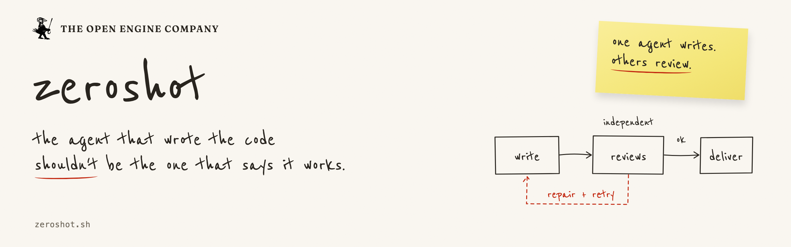
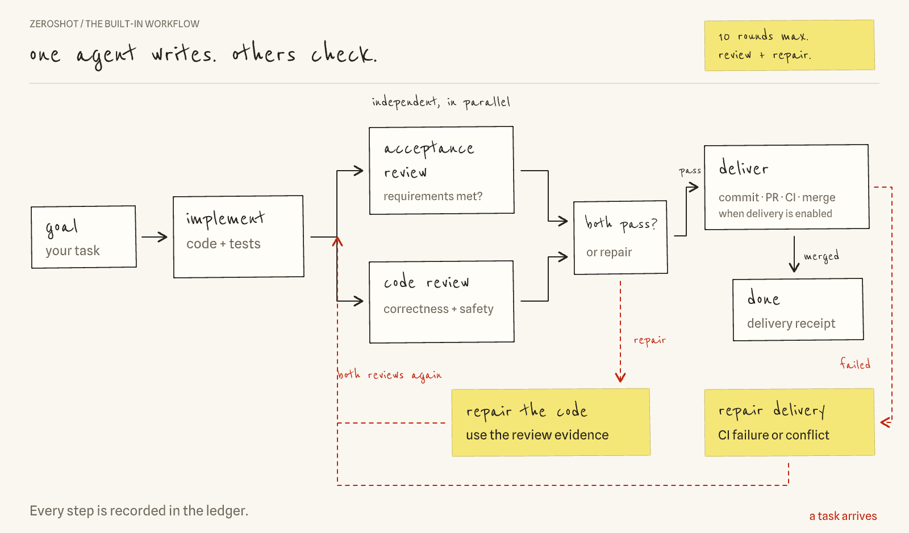

<div align="center">

<picture>
  <source media="(prefers-color-scheme: dark)" srcset="docs/brand/zeroshot-hero-dark.png">
  
</picture>

&nbsp;

<a href="https://discord.gg/fZyzf2Cut9"><picture><source media="(prefers-color-scheme: dark)" srcset="docs/brand/social/discord-cta-dark.png"></picture></a>
<a href="https://zeroshot.sh/?utm_source=github&utm_medium=readme&utm_campaign=zeroshot"><picture><source media="(prefers-color-scheme: dark)" srcset="docs/brand/social/zeroshot-site-dark.png"></picture></a>
<a href="https://theopenengine.com/?utm_source=github&utm_medium=readme&utm_campaign=zeroshot"><picture><source media="(prefers-color-scheme: dark)" srcset="docs/brand/social/website-dark.png"></picture></a>
<a href="https://x.com/OpenEngineHQ"><picture><source media="(prefers-color-scheme: dark)" srcset="docs/brand/social/x-dark.png"></picture></a>
<a href="https://www.linkedin.com/company/the-open-engine-company"><picture><source media="(prefers-color-scheme: dark)" srcset="docs/brand/social/linkedin-dark.png"></picture></a>

[](https://github.com/the-open-engine/zeroshot/releases/latest)
[](https://www.npmjs.com/package/@the-open-engine-company/zeroshot)
[](https://github.com/the-open-engine/zeroshot/actions/workflows/ci.yml?query=branch%3Amain)
[](https://github.com/the-open-engine/zeroshot/actions/workflows/opcore.yml?query=branch%3Amain)
[](https://coveralls.io/github/the-open-engine/zeroshot?branch=main)
[](https://the-open-engine.github.io/zeroshot/)
[](LICENSE)

&nbsp;

<a href="https://github.com/the-open-engine/zeroshot/stargazers"><picture><source media="(prefers-color-scheme: dark)" srcset="docs/brand/social/starred-by-dark.png"></picture></a>

</div>

# Zeroshot

**The agent that writes the code should not be the one that decides it works.**

We built Zeroshot because we were tired of being gaslit by agents telling us broken code was ready.

Zeroshot turns a software goal into an explicit multi-agent graph: one agent implements, independent
agents review, failures go back to a bounded repair loop, and nothing is delivered until the graph's
checks pass. The implementing agent never approves its own work.

Use the built-in graph or bring your own topology. Add reviewers, tests, and repair loops, then save
the setup as a profile for the next task.

The product site, [zeroshot.sh](https://zeroshot.sh/?utm_source=github&utm_medium=readme&utm_campaign=zeroshot), has the FAQ and Zeroshot Cloud pricing.

**[▶ Video: a single agent vs. Zeroshot](https://x.com/eivindmeyer_cv/status/2106898797771288828)** (scripted)

Questions, ideas, or a run worth showing? Join the [Zeroshot community on Discord](https://discord.gg/fZyzf2Cut9).

## Install

```bash
npm install -g @the-open-engine-company/zeroshot
```

The installer requires Node.js 18 or newer and installs a verified native binary for Linux
x64/arm64, macOS x64/arm64, or Windows x64. It also installs one Zeroshot skill for Codex, GitHub
Copilot, and Claude Code at user scope.

For local execution, install and sign in to Codex, Claude Code, or GitHub Copilot. Local runs can
reuse the harness's existing login, including subscription-backed sessions. See the
[installation guide](docs/getting-started/install.md) for harness prerequisites.

> **Zeroshot v8 is a hard interface cutover.** v8 replaces the Node.js runtime with a native
> `zeroshot` binary.

## Run your first task

This example uses Codex and keeps delivery local. **The worker edits the current Git worktree**,
so start in a clean worktree intended for the task.

Create `input.json`, replacing the example task with a change appropriate for your repository:

```json
{
  "task": "Add JSON output to the status command and cover it with focused tests."
}
```

Create `runtime.json`. Replace `YOUR_MODEL_ID` with a model identifier supported by your installed
Codex CLI:

```json
{
  "harness": "codex",
  "provider": "openai",
  "model": "YOUR_MODEL_ID",
  "effort": "high"
}
```

Start the run. Add `--validate-only` to check the graph, runtime configuration, and input first:

```bash
zeroshot run \
  --title "Add JSON status output" \
  --template software-change \
  --input input.json \
  --uniform-runtime-config runtime.json
```

Open another terminal to inspect the run:

```bash
zeroshot ui
```

Visit `http://127.0.0.1:4173/ui/` and open **Runs**. Stopping the UI server leaves active runs
running. The CLI also provides `zeroshot list`, `zeroshot status RUN_ID`, and `zeroshot logs RUN_ID`.

For other harnesses and providers, see [Runtimes and connections](docs/concepts/runtimes-and-connections.md).

## What the built-in workflow does

1. A worker implements the task.
2. Acceptance and code reviewers check the result independently, in parallel.
3. Rejected work goes to a repair worker, then through both reviews again.
4. With delivery enabled, accepted work proceeds through the configured Git and CI steps.
5. Delivery conflicts return through repair and review.

The graph defines the sequence, parallel steps, retry paths, and exit conditions before execution
starts. Runs are bounded, and events are recorded in a durable SQLite ledger. A passing run means
its configured checks accepted the work; coverage depends on the requirements, reviewers, tests,
and environment you provide.

<div align="center">
  <picture>
    <source media="(prefers-reduced-motion: reduce)" srcset="docs/assets/zeroshot-workflow.svg">
    <source media="(prefers-color-scheme: dark)" srcset="docs/assets/zeroshot-demo-dark.gif">
    
  </picture>
  <br>
  <em>Both reviews run again after a repair. Git delivery is optional.</em><br>
  <a href="docs/assets/zeroshot-workflow.svg">Static diagram</a>
</div>

## Bring your own graph topology

Choose each agent's model and instructions, which steps run in parallel, and when to retry.
For example, add a bugfinder and E2E tests after the code and acceptance review loop:

```text
Implementation
      ↓
Code review + acceptance review
      ↓
Bugfinder: adversarial tests
      ↓
E2E tests
      ↓
Delivery
```

The bugfinder and E2E stages are custom additions. Provide their test tools, services, and credentials,
and configure where failures route back for repair.

Inspect the built-in graph as a starting point:

```bash
zeroshot template show software-change
```

See the [graph contract](docs/reference/cluster/graph.md) for custom graph authoring and
[Prepare a runtime environment](docs/guides/runtime-environments.md) for dependency and service setup.

## Save and reuse a profile

A profile stores a graph and its runtime settings. Use **Profiles** in the browser UI to edit and
save your configuration. Keep different profiles for different kinds of work, or reuse one for the
next task.

Once you've saved a local profile named `my-profile`, run another task with it:

```bash
zeroshot run \
  --title "My next task" \
  --profile local:my-profile \
  --input input.json
```

The CLI and UI share the same local profiles. See
[UI setup](docs/getting-started/install.md#open-the-workspace-ui).

## Choose delivery and execution

Keep the first result local, then enable the delivery mode that fits your process:

| Delivery         | Behavior                                         |
| ---------------- | ------------------------------------------------ |
| No delivery flag | Keep the work local                              |
| `--push`         | Push the managed branch                          |
| `--pr`           | Prepare a mergeable pull request without merging |
| `--ship`         | Proceed through PR, CI, and merge                |

PR and ship runs address visible pull request review feedback by default; pass `--no-pr-feedback` to
ignore it.

Graphs can execute locally, on a self-hosted target, or in Zeroshot Cloud. Each environment needs
its own tools and authentication setup. Hosted merge plans, which coordinate several dependent jobs,
are a Zeroshot Cloud feature.

### Self-hosted: run the Docker target

Keep execution and durable state on infrastructure you control. The target image includes the native
engine plus pinned Codex, Claude, and GitHub Copilot harness CLIs.

```bash
docker run --detach --restart unless-stopped --name zeroshot-target \
  -p 127.0.0.1:8080:8080 \
  -v zeroshot-data:/var/lib/zeroshot \
  ghcr.io/the-open-engine/zeroshot-target:latest

zeroshot target add local --url http://127.0.0.1:8080 --direct
```

The target also serves its profile editor and run viewer at `http://127.0.0.1:8080/ui/`.

See the [target image guide](docker/zeroshot-target/README.md) for persistent storage, network
isolation, builds, and HTTPS.

### Zeroshot Cloud: close the laptop

Use the built-in `cloud` target at `https://api.cloud.zeroshot.sh` for a shared team queue and
durable run history:

```bash
zeroshot target login cloud
```

Open the printed link to sign in with the device code already filled in. Use `--target cloud` when
submitting runs. The [Zeroshot Cloud docs](https://cloud.zeroshot.sh/docs) cover organizations, the
GitHub App, saved connections and profiles, and starting runs from issues.

A failed run with a recoverable workspace can be
[restarted or resumed](docs/guides/observe-and-control.md#restart-or-resume-a-failed-run).

## Research graph

Zeroshot also includes an `auto-research` graph for ten bounded iterations of experiments with
independent review of evidence, method, and progress. It keeps adopted, record-only, and aborted
results under `.zeroshot/research`; add `--push` when each finalized iteration should be published.

```bash
zeroshot template list
zeroshot template show auto-research
```

See [Execution](docs/concepts/execution.md) for the research workflow's decision and evidence rules.

## Community

- [Discord](https://discord.gg/fZyzf2Cut9): ask questions, share runs and graphs, and talk to the team.
- [GitHub Issues](https://github.com/the-open-engine/zeroshot/issues): reproducible bugs and feature requests.

## Reference

- [Versioned documentation](https://the-open-engine.github.io/zeroshot/)
- [Zeroshot Cloud documentation](https://cloud.zeroshot.sh/docs)
- [Get started](docs/getting-started/first-run.md)
- [CLI reference](docs/zeroshot-cli.md)
- [Target image guide](docker/zeroshot-target/README.md)
- [Python SDK](sdks/python/README.md)
- [Cluster API reference](https://the-open-engine.github.io/zeroshot/current/reference/cluster/api/)
- [Graph contract](docs/reference/cluster/graph.md)

Also check out: [Opcore](https://github.com/the-open-engine/opcore).

## Development

```bash
npm ci
npm run check
cargo test --workspace # Unix; Windows: powershell -NoProfile -File scripts/test-windows.ps1
```

Node.js builds the static UI and supports repository tooling and npm delivery; Rust serves the UI.
See [UI development](ui/README.md),
[CONTRIBUTING.md](CONTRIBUTING.md), [PUBLISHING.md](PUBLISHING.md), and [SECURITY.md](SECURITY.md).

## License

MIT. See [LICENSE](LICENSE).
