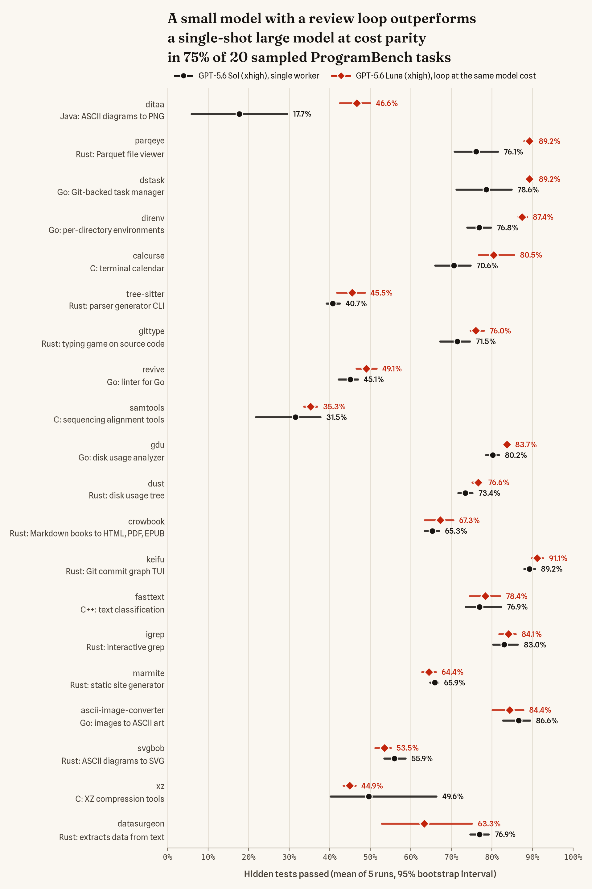

# Zeroshot on ProgramBench

A reproducible, fully containerized benchmark of a minimal Zeroshot graph on
[ProgramBench](https://github.com/facebookresearch/ProgramBench): rebuild a program from its
compiled reference executable and documentation, offline, then score the rebuild with
ProgramBench's hidden behavioral tests.

## Question

**H1 — "Don't trust, verify":** with the same model and the same generic builder prompt, does an
independent check-and-repair loop improve the hidden-test pass rate?

The first experiment (`experiments/luna-xhigh-svgbob.json`) runs GPT-5.6 Luna at `xhigh` effort on
`ivanceras__svgbob.6d00ad9` (ASCII diagrams to SVG; 472 scored tests; best public score 65%):

| Arm | Graph | Runs |
|---|---|---|
| `loop` | `build → check`, repeated until the check accepts (at most 4 rounds) | 5 |
| `single` | `build` once | 3 |

Runs are interleaved in a fixed, pre-registered order (`L S L L S L S L`), four at a time. Every
loop run is snapshotted when each build finishes, so the workspace after build 1 is a same-run,
single-worker baseline; the single arm checks that this baseline behaves like a real single run.

**Pre-registered decision rule** (also in the experiment file; computed in whole tests):

- **Eligibility:** a loop run counts only if it completed; its build-1 snapshot was archived and
  both it and the final workspace were scored on all tests (a workspace that fails to compile or to
  produce a usable executable scores 0, as on the leaderboard; an evaluation infrastructure error is
  re-evaluated once and disqualifies the run if it persists); build 1 ended normally or at its node
  time limit (a crash or malformed response cuts the baseline short); it has no disqualifying audit
  finding (binary instrumentation such as `LD_PRELOAD`, `LD_AUDIT`, `LD_DEBUG` or ptrace, direct
  model-API calls, proxy use by tools, process-environment reads, web search); its builder did not
  touch harness internals in round 1; neither scored workspace contains or builds the reference
  executable; and the Codex config, the harness files and the Codex home's instruction files were
  unchanged and checked after every node, with no transcript showing loaded `AGENTS.md`
  instructions. All 5 loop runs must be eligible, otherwise the verdict is *inconclusive*.
- **Supported:** every loop run gains at least 1 percentage point (above eval noise) and the median
  gain is at least 5 points.
- **Not supported:** the median gain is below 2 points. Otherwise *inconclusive*.
- Reported per run as covariates, not used for eligibility: whether the reference executable still
  existed after build 1 (a builder may overwrite it, leaving the checker only the documentation),
  rounds and verdicts, and cost.
- The final workspace counts even when the 6-hour cap force-stops a run. Attempts that fail for
  infrastructure reasons are re-run once (the runner refuses a second re-run); the discarded attempt
  is kept and reported.

A supported H1 shows that check-and-repair beats stopping after one build. It does not by itself
show that the checker's *independence* is what helps (the loop also spends more compute); that is
H2, a later experiment with a compute-matched self-review arm.

### Pilot result and the adjusted follow-up

`luna-xhigh-svgbob-v1` (standard ProgramBench conditions): **H1 not supported.** All 5 loop runs
were eligible; per-run gains were 0, −14.8, −15.5, +4.4 and +4.7 points (median 0). The loop helped
in the two runs whose builder kept the reference, and hurt where the builder had overwritten
`./executable` (the task's build target is the reference's own path). Without the reference,
checkers judged against the README, which contradicts the reference: it documents an Arial
default font where the program renders `Iosevka Fixed, monospace`, an `--inline` flag it lacks,
and a server mode that belongs to a separate program. Builders complied and lost about 70 tests
each time. This split is exploratory (2 runs against 3).

`luna-xhigh-svgbob-v2` keeps the model, prompts, graphs, limits and decision rule, runs all eight
attempts at once (4 CPUs and 7 GB each, instead of four at a time with 7 CPUs and 13 GB), and makes
two declared adjustments to the environment (`task.reference_path`, `task.doc_fixes` in the experiment file; applied by
`agent/prepare-task.py` when the image is built and recorded in the manifest):
- the reference moves to `/reference/executable`, a root-owned directory the agent can run it
  from but cannot overwrite, move or delete; the task statement points there, and the build
  target stays `./executable`;
- the three README statements that contradict the reference are corrected in place and folded
  into the workspace's initial commit. The reference's own `--help` text is unchanged (it also
  claims an Arial default), and the ambiguous `--scale` line is left as is.

Both adjustments deviate from standard ProgramBench conditions, so v2 answers a different question
(does the loop help when every node keeps the oracle and accurate documentation?) and is reported
next to v1, not instead of it.

v2 result: **H1 inconclusive** under the pre-registered rule. All 5 loop runs gained (+1.9, +2.1,
+10.8, +3.6 and +0.2 points; median 2.1, sign test p = 0.031), with no collapses, but one run
gained less than 1 point and the median is below 5. No checker ever accepted: every loop ran all 4
rounds.

`luna-xhigh-svgbob-v3` asks whether the gains keep compounding. It keeps v2's environment and
settings and raises the loop cap from 4 to 50 rounds (about 5 minutes and $0.12 per round in v2,
so 50 rounds fit the 6-hour cap). Every snapshot is archived, but a pre-registered schedule
(`eval.rounds`) scores only builds 1, 2, 3, 5, 10, 20, 30, 40 and 50 plus the final workspace; the
summary adds a learning-curve table. The H1 rule is unchanged (final against build 1).

v3 result: **H1 supported.** All 5 loop runs were eligible and all gained (+2.5, +14.0, +10.4, +7.2
and +16.1 points; at least 12 tests each, median 10.4). No checker ever accepted, so every loop ran
all 50 rounds (2.75 to 4.7 hours). The mean gain over build 1 was +3.7 points after 5 rounds, +4.8
after 10, +6.4 after 20, +8.9 after 30 and +10.0 after 50 (95% percentile bootstrap interval over
runs 5.8 to 14.1): most of it came by round 30, and three runs changed little over their last 10 to
30 rounds. The best run reached 60.0%. The single-worker finals scored 38.6, 41.7 and 44.3%. The
loops cost $6.73 to $9.42 each (about $0.15 per round) and the single runs $0.20 to $0.35.


`scripts/plot_pass_rate.py figures/luna-xhigh-svgbob-v3.json` draws the figure (needs matplotlib and
numpy). The published lines are single mini-SWE-agent runs from the ProgramBench submissions
repository, scored with the same ignore list.

`sol-xhigh-svgbob-v4` asks whether the loop also helps a stronger model. It keeps v3's environment,
prompts, graphs and limits, switches to GPT-5.6 Sol at xhigh, caps the loop at 10 rounds and scores
every round. It drops the single-worker arm: a single worker is exactly the loop's first build (the
builder's input is byte-identical in both arms), and the arms' first builds differed in both
directions across v1 to v3 (v3: single runs 196.0 against loop first builds 215.8 tests, exact
permutation p = 0.20). The H1 rule is unchanged (5 loop runs, final against build 1). At Sol's
promotional prices, v3's token use over its first 10 rounds would cost about $170 for 5 runs.

v4 result: **H1 inconclusive**, narrowly. All 5 loop runs were eligible and all gained (+4.2, +2.5,
+8.7, +4.7 and +4.0 points; at least 12 tests each; sign test p = 0.031), but the median gain of 4.2
points is below the pre-registered 5. No checker ever accepted: every loop ran all 10 rounds. Sol's
first builds averaged 55.9%, where Luna's loops ended after 50 rounds (55.8%). The mean gain was +3.0
points after 3 rounds, +4.0 after 5 and +4.8 after 10, about what Luna gained over its first 10
rounds, but Sol's came early and then flattened. The best run reached 63.6% (300 tests), just below
the best published result. The loops took 61 to 163 minutes and cost $22 to $64 each ($173 in
total; a first build cost about $3.75).


`opus5-xhigh-svgbob-v5` asks the same question of another model family and harness: v4's
environment, prompts, graphs, limits and H1 rule, with Claude Opus 5 at xhigh running in Claude
Code (the harness Zeroshot uses for Claude models) instead of GPT-5.6 Sol in Codex. Claude Code
needs its own isolation (see Environment and isolation); the smoke test proves each part in a real
run. Opus 5 at xhigh is far slower per round: the smoke's builds did not finish within 40 minutes,
the model was generating for 109 of its 120 minutes (about 90 tokens a second), and the published
single Opus 5 xhigh run on this task made 168 calls and 370K output tokens (Sol xhigh: 37 and 58K).
So v5 keeps all 10 rounds and drops the time cap (the attempt limit is a week; builds keep their
3-hour and checks their 1-hour limit). Each attempt's model gateway refuses further requests once the
attempt's API cost reaches $1,000, a safety net a run is not expected to reach; the smoke spent about
$13.50 per hour.

`luna-xhigh-ditaa-v1` and `luna-xhigh-chroma-v1` ask whether v3's result holds beyond svgbob. Each
reruns v3's model, prompts, graphs, limits, evaluation schedule and H1 rule on another task from
the shortlist svgbob came from (small by measured code size, rarely solved by published runs), with
5 loop runs and no single-worker arm, as in v4 and v5. Each task gets its own H1 verdict.
- ditaa (`stathissideris__ditaa.f2286c4`, 609 scored tests; best published 38.4%, median of the 21
  published runs 17%) turns ASCII diagrams into PNG images; most tests compare PNG bytes with the
  Java original's output.
- chroma (`alecthomas__chroma.8d04def`, 503 scored tests; best published 46.5%, median 9%) is a
  syntax highlighter; most tests check the exact highlighting of one of about 250 languages. Its
  default style fails to load in the task image (`open swapoff: no such file or directory`), as it
  did in the published runs, so the reference highlights only with an explicit `--style`.

Only the general adjustment carries over: the reference moves to `/reference/executable`. The
documentation stays as shipped, with no task-specific corrections. The smoke test's scoring check
re-scores a published run of each task (`task.fidelity_reference`: GPT-5.5 xhigh on ditaa, Opus 5
xhigh on chroma). Scoring uses v3's settings except for its overall time limit, 12 hours instead of
4: ditaa's tests run one at a time, and its smoke test took 37 minutes a workspace. The two
experiments run one after the other.

`glm52-xhigh-svgbob-v6` and `glm52-xhigh-ditaa-v1` repeat Luna's runs on both tasks
(`luna-xhigh-svgbob-v3` and `luna-xhigh-ditaa-v1`) with GLM-5.2, an open-weights model from Z.ai,
at xhigh: the same environment, prompts, graphs, limits, evaluation schedule and H1 rule, with 5
loop runs each and no single-worker arm. GLM runs in Claude Code, not Codex. Zeroshot's Codex
harness always sends an output schema, and GLM on OpenRouter then answers with the schema's JSON
at once and never calls a tool: in `smoke-glm52`, a Codex smoke test, builders returned in seconds
and a checker accepted an empty workspace. Claude Code asks for its structured result through a
tool call at the end instead. Claude Code reaches OpenRouter through the model gateway, which holds
the OpenRouter key, pins Z.ai's own endpoint (`provider.order: ["z-ai"]` without fallbacks;
OpenRouter otherwise routes among about 30 providers serving fp4 to fp8 deployments), refuses any
model but `z-ai/glm-5.2` and records OpenRouter's billed cost for every request. Claude Code limits
a response to 32,000 output tokens for a model its catalog does not know (64,000 for Opus 5): in
`smoke-glm52-cc`, the GLM smoke test, a builder rewrote its whole source file in one response, hit
that limit and had the cut-off file rejected as invalid JSON. The GLM runs therefore set
`model.max_output_tokens` to 128,000, the most Claude Code sends; Z.ai serves up to 131,072. Against
a stub API, Claude Code still compacts its context after 167,000 tokens at 32,000, 64,000 and
128,000, as Opus did in v5. GLM-5.2 reads text only (OpenRouter lists its input as text), but Claude
Code's Read tool returns an image file as an image, and OpenRouter then rejects the whole request:
on ditaa, whose program draws PNG files, two of five builders crashed this way within a minute. The
ditaa run therefore declares `model.image_input: false`, and the gateway replaces every image in a
request with a one-line note that the model cannot view it; svgbob's output is SVG text, and its GLM
run sent no image. The reported ditaa run is the third start: the first stopped when the OpenRouter
account ran out of credit (every first build cut off after 2 h 15 min), the second was stopped after
3 minutes for the image failure. Like Luna's runs, they have no spending cap: only the protocol's time
limits apply. Z.ai's prices on 2026-10-01 were $1.40 input, $0.26 cached input and $4.40 output per
million tokens. The GLM runs therefore differ from Luna's in model, provider and harness, and the
comparison is descriptive.

### Cost-parity study (pre-registered 2026-10-04)

Can a cheaper model's check-and-repair loop beat a more expensive model's single worker at the same
model cost? GPT-5.6 Luna at xhigh ($0.20 input, $1.20 output per million tokens) runs the loop;
GPT-5.6 Sol at xhigh ($4 and $20 at the promotional prices v4 used) runs once, as a single worker:
the build node alone, byte-identical to round 1 of the loop. Five tasks, 5 runs per arm each:

- svgbob (Rust, ASCII diagrams to SVG): existing runs only. Sol's single workers are
  `sol-xhigh-svgbob-v4`'s first builds and Luna's loops are `luna-xhigh-svgbob-v3`'s. From the rounds
  scored so far, this task already leans towards Sol at parity (Luna about 53.5% at Sol's mean cost
  of $3.75 per run against Sol's 55.9%); it stays in the study.
- ditaa (Java, ASCII diagrams to PNG): Luna's loops are `luna-xhigh-ditaa-v1`'s; Sol's single
  workers are new (`sol-xhigh-ditaa-single`).
- calcurse (C, a terminal calendar), revive (Go, a linter for Go) and fasttext (C++, text
  classification and word vectors): new `luna-xhigh-<task>-v1` loops with ditaa's protocol and new
  `sol-xhigh-<task>-single` workers, after a `smoke-<task>` test each. These three were chosen before
  any run: tasks with at most 800 hidden tests split over more than one test branch, published GPT-5.6
  Sol xhigh between 15% and 80% and the best published result at least 5 points above it, one task
  per language not yet covered, and within a language the domain least like the two diagram renderers.

The comparison (each experiment's `decision_rule.cost_parity`): C is the mean model cost of a task's 5
Sol single workers. Each Luna loop run is compared through its parity workspace, the workspace after
the last build whose cumulative cost (builds 1 to k and checks 1 to k-1, from the transcripts at
Luna's prices) does not exceed C; build 1 if build 1 alone costs more; the final workspace if the run
stops first. On each task, Luna outperforms Sol at cost parity if the mean pass rate of its 5 parity
workspaces is higher than the mean of Sol's 5 single workers, and robustly if the two 95% bootstrap
intervals do not overlap. The study reports every task in one of these categories (no task is
dropped afterwards).

All attempts of the study run side by side on a 64-CPU host (`ZSBENCH_ALLOW_PARALLEL=1`, recorded in
each manifest) without evaluation: the agents mostly wait on the model API. Evaluations follow in
batches sized to the host, and the parity workspaces are scored once both arms have finished (every
round's snapshot is archived): `scripts/zsbench parity experiments/luna-xhigh-<task>-v1.json --against
experiments/sol-xhigh-<task>-single.json` (for svgbob, `--against` v4, whose first builds are the
single workers) writes `results/<luna experiment>/parity/<sol experiment>.json` and `.md`, scoring the
parity snapshots outside the pre-registered schedule.

Result on the first five tasks (2026-10-04): Luna's loop has the higher mean on 4 of 5 tasks,
robustly on ditaa (46.6% against 17.7%) and calcurse (80.5% against 70.6%); its intervals overlap
Sol's on revive (49.1% against 45.1%) and fasttext (78.4% against 76.9%), and on svgbob Sol is ahead
with overlapping intervals (55.9% against 53.5%). The budgets were $2.88 to $4.66 per run, which
Luna's loops reached after 11 to 42 rounds; Sol's single workers took 6 to 14 minutes, Luna's 50-round
loops 2.4 to 3.5 hours. Every run of both arms entered the comparison. One of Sol's ditaa workers
scored 0 because its Java source contains a bullet character and `javac` in the evaluation environment
reads source as US-ASCII, as on the leaderboard; without it Sol's ditaa mean is 22.1%, still well below
Luna's. Two of Luna's fasttext loops left trained model files of up to 800 MB in their workspaces
(about 65 GB of snapshots each), which only slowed archiving and the summary's scans (now parallel).
The first five tasks' model cost was $164.68: $79.73 for Sol's 20 single workers, $83.07 for Luna's
15 full loops (beyond their parity rounds as well) and $1.90 for the smoke tests. Their table and
figure are part of the 20-task result below.

#### Expansion to 20 tasks (pre-registered 2026-10-05)

With five tasks the result could depend on which tasks were picked, so the same comparison runs on 15
more, drawn by a fixed rule before any of their runs. A task qualifies if GPT-5.6 Sol at xhigh passed
between 10% and 90% of its scored tests in its published run, the best published result is at least
5 points higher, it has at most 1,500 scored tests split over at least two test branches (chroma's
single branch hung in evaluation) and it is not already in the study. Of the 72 qualifying tasks, 15
were drawn at random (seed 20261005): 9 Rust, 4 Go and 2 C, so that with the first five the 20 tasks
follow ProgramBench's language mix. Published scores come from ProgramBench/submissions at
`794fa30b` (leaderboard ignore list applied), languages and test branches from ProgramBench at
`b08d862`. `experiments/selection/cost-parity-expansion.json` holds the pool and the draw, and a test
repeats the draw.

| Task | Language | Scored tests | Published Sol xhigh | Best published | What it is |
|---|---|---|---|---|---|
| parqeye | Rust | 479 | 71.8% | 99.0% | Parquet file viewer |
| tree-sitter | Rust | 1,232 | 44.0% | 58.7% | parser generator and parsing CLI |
| igrep | Rust | 385 | 51.9% | 92.9% | interactive grep |
| marmite | Rust | 668 | 65.0% | 76.8% | static site generator |
| datasurgeon | Rust | 502 | 80.9% | 86.5% | extracts emails, IPs, hashes and more from text |
| crowbook | Rust | 807 | 30.1% | 85.9% | Markdown books to HTML, LaTeX, PDF and EPUB |
| gittype | Rust | 103 | 81.1% | 91.3% | typing game on source code |
| keifu | Rust | 262 | 85.1% | 94.7% | Git commit graph in the terminal |
| dust | Rust | 584 | 70.0% | 91.8% | disk usage tree |
| direnv | Go | 850 | 79.6% | 93.1% | per-directory environment loader |
| gdu | Go | 1,161 | 80.0% | 89.8% | interactive disk usage analyzer |
| dstask | Go | 1,278 | 82.1% | 96.1% | Git-backed task manager |
| ascii-image-converter | Go | 465 | 80.4% | 96.1% | images to ASCII and Braille art |
| xz | C | 1,410 | 16.7% | 84.7% | XZ Utils compression tools |
| samtools | C | 1,425 | 39.0% | 49.8% | sequencing alignment tools (bioinformatics) |

Each task follows the protocol of calcurse, revive and fasttext: `smoke-<task>` (its scoring check
must match GPT-5.5 xhigh's published score on the task within 2 points), then 5 loop runs of
`luna-xhigh-<task>-v1` and 5 single workers of `sol-xhigh-<task>-single`, compared by the same rule
and verdict categories (`decision_rule.cost_parity`). One change, to scoring effort only: Luna's
loops are scored at build 1 and in the final workspace (`eval.rounds` `[1]`), and their parity
workspaces through `bench parity`, so these tasks get no learning curves; every round's snapshot is
still archived. Every task is reported and none is dropped afterwards. No pooled test across tasks is
pre-registered: the result is the 20 per-task verdicts.

Changes during the run (2026-10-05), all decided before any of Luna's expansion loops was scored
(only the smoke tests and some of Sol's single workers had been):

- keifu, both arms rerun twice. Zeroshot 10.8.0's run controller adopts orphaned processes (it is a
  child subreaper) but reaps only its nodes' process groups, so a process orphaned in another
  group stays a zombie. keifu's agents test the terminal UI in pseudo-terminals and tmux, which
  orphan such processes by the thousand: within 30 minutes its containers hit their 8,192-process
  limit and no tool command could start (other tasks leaked far more slowly). The first start
  (`luna-xhigh-keifu-v1`, `sol-xhigh-keifu-single`, `smoke-keifu`) was stopped. The first rerun
  (`-v2`) ran `codex` under `agent/codex-reaper.c` (`resources.reap_orphans`), a subreaper between
  Zeroshot and Codex that reaped those orphans while their node ran, with Codex kept in Zeroshot's
  process group so its kills still apply. But a tmux server that a node leaves running outlives
  the node and is then adopted by the controller: in one loop the reference app inside such a
  server kept creating orphans, 23,000 zombies within 50 minutes. The v2 loops were stopped, and
  keifu reran again (`luna-xhigh-keifu-v3`, `sol-xhigh-keifu-single-v3`, `smoke-keifu-v3`) with a
  reaper that also ends what a node leaves running when its Codex exits, as Zeroshot means a
  node's processes to end with the node (it kills the node's process group). Nothing else changed;
  neither earlier start is analysed. An earlier smoke test of keifu stopped at its diagnostic
  because the model mistyped the diagnostic script (`results/smoke-keifu.aborted-diagnostic-typo`).
- ascii-image-converter, Sol's single workers re-run. Their proxies' container names
  (`zsbench-sol-xhigh-ascii-image-converter-single-01-single-net-proxy`) are longer than a DNS
  label's 63 characters and did not resolve, so Codex never reached the model API: all five
  attempts retried for 90 minutes without a model response, used no tokens and changed nothing.
  They were stopped and re-run from scratch (the pre-registered re-run for infrastructure errors),
  with every attempt now reaching its proxy by a short alias on its own network. No other
  experiment's names were that long.
- Process limit. At 05:25 UTC every running attempt container of both arms had its limit raised
  from 8,192 to 65,536 processes, and so did every container started later, so that the slower
  leaks could not end a long loop.
- Scoring under equal load. Sol's single workers finished within the loops' first hour and the
  first of them were scored while 75 loops ran (load average about 75 on 64 CPUs); timing-sensitive
  tests could fail more there than in Luna's later scoring. Each task's two arms are therefore
  scored side by side once its loops have finished, Sol's workers again (`eval --force`; the earlier
  scores are kept as `scores.under-load.json` and not used), then compared at parity.
- Audit fix. The disqualifying process-environment rule matched `/proc/self/environ` in 4 of
  direnv's 5 loops: agents testing an environment-variable loader printed the environment of
  programs they had just started with `env -i` (for example `env -i A='a b' python3 -c
  'print(open("/proc/self/environ","rb").read())'`). A process reading its own entry sees only what
  it already has, and tool processes never hold the key, so the rule now ignores `/proc/self` and
  `/proc/thread-self`. No other run in the study matched the rule. Found when direnv's comparison
  rested on its one unflagged loop; every matched command is listed in its summary.
- Scorer fix (`6ad2b674`). The pinned-plugin check now covers only test runs in which pytest ran
  (ascii-image-converter has branches with nothing to test), and a branch whose pytest cannot load an
  installed plugin before any test runs counts as tests not passed, like a timed-out branch (dust's
  evaluation image loads a libtmux plugin that pytest 9 rejects, the same for every submission).
- Scoring fidelity. On four tasks our scoring of GPT-5.5 xhigh's published archive does not match
  the leaderboard: crowbook (67.0% against 2.9%; the leaderboard's run failed even `--help` tests that
  pass here), dust (74.8% against 87.3%; its golden outputs embed the leaderboard machine's
  filesystem block sizes, and its libtmux branch cannot run), tree-sitter (48.8% against 46.1%; 33
  tests pass only here) and samtools (7.7% against 22.6%; see the result below). Every difference is
  deterministic, and both arms are scored the same way, so the comparisons stand, but absolute scores
  on these tasks are not comparable with the leaderboard.

#### Result on 20 tasks (2026-10-05)

Luna's loop has the higher mean on 15 of the 20 tasks (75%), robustly on 7: ditaa, parqeye, dstask,
direnv, calcurse, gittype and gdu. Sol's single worker has the higher mean on 5 (marmite,
ascii-image-converter, svgbob, xz and datasurgeon), never robustly. As pre-registered, there is no
pooled test; the counts only describe the 20 verdicts.

| Task | Budget | Sol single worker | Luna loop at parity | Rounds within budget | Verdict |
|---|---|---|---|---|---|
| ditaa (Java) | $4.66 | 17.7% (5.9 to 29.5) | 46.6% (42.5 to 50.0) | 26 | Luna, robustly |
| parqeye (Rust) | $6.96 | 76.1% (70.8 to 81.5) | 89.2% (87.9 to 90.1) | 40 | Luna, robustly |
| dstask (Go) | $4.90 | 78.6% (71.2 to 84.8) | 89.2% (88.4 to 90.1) | 38 | Luna, robustly |
| direnv (Go) | $6.05 | 76.8% (73.9 to 79.8) | 87.4% (86.4 to 88.6) | 33 | Luna, robustly |
| calcurse (C) | $4.41 | 70.6% (65.9 to 74.7) | 80.5% (76.8 to 85.4) | 37 | Luna, robustly |
| tree-sitter (Rust) | $4.03 | 40.7% (39.2 to 42.5) | 45.5% (41.8 to 48.6) | 25 | Luna, intervals overlap |
| gittype (Rust) | $4.76 | 71.5% (67.2 to 74.6) | 76.0% (74.7 to 78.0) | 41 | Luna, robustly |
| revive (Go) | $4.00 | 45.1% (42.2 to 46.9) | 49.1% (46.6 to 51.5) | 37 | Luna, intervals overlap |
| samtools (C) | $3.47 | 31.5% (21.8 to 37.7) | 35.3% (33.7 to 36.9) | 15 | Luna, intervals overlap |
| gdu (Go) | $3.79 | 80.2% (78.6 to 81.7) | 83.7% (82.8 to 84.3) | 31 | Luna, robustly |
| dust (Rust) | $3.96 | 73.4% (71.6 to 75.2) | 76.6% (75.2 to 77.6) | 30 | Luna, intervals overlap |
| crowbook (Rust) | $4.03 | 65.3% (63.4 to 66.9) | 67.3% (63.4 to 70.4) | 18 | Luna, intervals overlap |
| keifu (Rust) | $6.61 | 89.2% (87.9 to 90.6) | 91.1% (89.8 to 92.6) | 43 | Luna, intervals overlap |
| fasttext (C++) | $2.88 | 76.9% (73.5 to 82.2) | 78.4% (74.5 to 82.0) | 18 | Luna, intervals overlap |
| igrep (Rust) | $3.74 | 83.0% (80.3 to 86.4) | 84.1% (81.8 to 85.8) | 34 | Luna, intervals overlap |
| marmite (Rust) | $4.60 | 65.9% (64.8 to 66.7) | 64.4% (62.8 to 66.1) | 26 | Sol, intervals overlap |
| ascii-image-converter (Go) | $5.04 | 86.6% (82.7 to 89.4) | 84.4% (80.1 to 87.7) | 30 | Sol, intervals overlap |
| svgbob (Rust) | $3.75 | 55.9% (53.4 to 58.7) | 53.5% (51.2 to 55.0) | 25 | Sol, intervals overlap |
| xz (C) | $4.15 | 49.6% (40.2 to 66.3) | 44.9% (43.4 to 46.4) | 25 | Sol, intervals overlap |
| datasurgeon (Rust) | $2.18 | 76.9% (74.7 to 79.2) | 63.3% (52.8 to 75.1) | 30 | Sol, intervals overlap |



- Every run of both arms entered the comparisons (direnv's after the audit fix above).
- samtools: Sol's single worker 05 lost its largest test branch to ProgramBench's 1-hour limit (two
  pytest workers stayed busy for the whole hour), so its tests count as not passed, as on the
  leaderboard. Without that run Sol's mean would be 36.3%, narrowly above Luna's 35.3%, so this
  verdict rests on it. samtools was scored on a quiet host after its smoke test lost the same branch
  under load; a re-check on the idle host gave the published GPT-5.5 archive the same 7.7%, so the
  stall is not load. No compared Luna workspace hit the limit anywhere; Sol's ditaa worker 02 did.
- xz: Sol's mean rests on one strong run (04 passed 1,166 of 1,410 tests; the other four 552 to 625).
- datasurgeon: Luna's loops split, three plateauing near 53% and two reaching 75 to 82%.
- Time: Sol's single workers took 7 to 21 minutes; Luna's loops reached the budget after 1.5 to 4.9
  hours, about 13 times as long (median over tasks).
- The expansion's model cost was $940.95: $386.24 for Sol's single workers, $544.07 for Luna's loops
  (all 50 rounds, beyond their parity rounds as well) and $10.63 for smoke tests, including keifu's
  two discarded starts.

Per-task results: `figures/cost-parity/*.json` (from `bench parity`); figure:
`scripts/plot_parity.py figures/cost-parity/*.json` (rows by Luna's lead; `--order luna` sorts them by
Luna's score).

### Prompt study (pre-registered 2026-10-09)

Is the loop's benefit the topology, or would the same instructions in one session do as well? The
same GPT-5.6 Luna at xhigh runs once per attempt, as a single build node whose instructions describe
the loop (`prompts/builder-checker.md`): the builder's and checker's prompts verbatim, the verifier
guidance Zeroshot gives every check, and three sentences of glue:

> Work in rounds. In each round, act first as the builder and then as the checker, following the
> instructions for each role below. If the checker rejects, its list of discrepancies is the review
> feedback for the builder in the next round. Repeat until the checker accepts, then return.

Everything else is Luna's single run on the same task (task statement, input, model, resources,
evaluation, prices), except the node's time limit: 6 hours instead of 3, since the loops took 1.5 to
4.9 hours to reach the cost-parity budget. The 50-round cap is not mentioned, as the loop's own nodes
never saw it. What a prompt cannot copy is the separation: the loop's checker starts a fresh session
every round, while here both roles share one.

The runs are `luna-xhigh-<task>-prompt`, 5 sessions on each of the 20 tasks, all launched side by
side; each task is scored once its sessions have finished (2 tasks at a time while sessions still
run, 3 afterwards; samtools on a quiet host, as before). The comparison (each experiment's
`decision_rule.prompt_study`) reuses the cost-parity machinery with the sessions in place of Sol's
single workers. P is the sessions' mean model cost at Luna's prices.

- Equal cost: each loop run is compared through its last build whose cumulative cost does not exceed
  P (`scripts/zsbench parity experiments/<loop>.json --against experiments/luna-xhigh-<task>-prompt.json`);
  the higher mean leads, robustly if the 95% bootstrap intervals do not overlap.
- Equal score: the cost at which the loop runs first reach the sessions' mean score, as a share of P
  (`scripts/zsbench match` with the same arguments); not reached if the loops never get there.

As before, every task is reported and there is no pooled test.

## The graph and prompts

Both arms share one byte-identical `build` node; round 1 of the loop is exactly the single arm.

```
loop "solve" (max 4 rounds; stop when check.verdict = accepted)
  build  — Codex, keeps its own session across rounds; input = task + feedback ("" in round 1)
  check  — Codex, fresh session every round; verdict accepted | rejected; its diagnostic
           becomes the builder's feedback for the next round
```

Failed rounds follow Zeroshot's normal semantics. A build that crashes or times out leaves the
workspace as it is, the check still runs, and the next round's builder starts a new thread (after a
malformed response it keeps its thread). A check
that errors records no verdict, so the loop continues and the builder receives the previous feedback
again (none, if the first check errors). Zeroshot retries a crashed check once, never a timeout or
an invalid response.

The only text we wrote is two generic role prompts, frozen before any run
(`prompts/builder.md`, `prompts/checker.md`):

> **Builder:** Complete the task described in the input. Keep working and verifying your own work
> until you believe the result fully satisfies the task. If review feedback is provided, address
> every point without breaking what already works.

> **Checker:** Independently judge whether the current workspace satisfies the task. Derive your own
> checks from the task statement and whatever it makes available; do not rely on the builder's
> tests, notes, or claims. Run the checks. Accept only with concrete evidence that nothing is wrong.
> Otherwise reject and list the most important discrepancies, each with a minimal reproduction.

The prompt study's single sessions use a third file, `prompts/builder-checker.md`, which quotes both
(see above).

Zeroshot wraps each prompt in its standard node guidance (for workers: install
manifest/lockfile dependencies and verify before returning; for verifiers: do not modify reviewed
material) and a JSON response contract. All task knowledge comes from the benchmark's own task
statement, `prompts/task.md`, generated by `scripts/build_task_prompt.py` from the upstream
mini-SWE-agent ProgramBench prompt (`prompts/upstream/`, SWE-agent/mini-swe-agent `main` at
`04d809ce`). The script removes only scaffold mechanics (the persona line, the one-bash-command
protocol, the submit sentinel, command examples); every other line is verbatim. The unit tests
re-derive it byte-for-byte.

## Environment and isolation

- **Task environment:** the official ProgramBench task image, pinned by digest, unchanged except
  for Zeroshot and Codex's full platform package (checksum-pinned releases) and a Codex config.
  The agent runs as the image's non-root `agent` user; the reference executable is execute-only.
  The image's own sudo rules (package managers, cargo, go) are left as ProgramBench ships them.
  Their install hooks amount to root, so the harness files (Zeroshot, Codex, Codex's system config)
  are fingerprinted at the start, after every node and at the end, and a change disqualifies the run.
- **Network:** every attempt gets its own internal Docker network whose only exit is its own
  tinyproxy, which allows HTTPS `CONNECT` to `api.openai.com` and nothing else. Tool commands get
  no proxy settings and no DNS, so they have no route out, like the upstream `--network none`;
  only Codex itself reaches the model API. Codex web search is disabled (it runs server-side and
  would bypass the proxy). Codex's own background requests (github.com, chatgpt.com) are refused
  and logged.
- **Secrets:** the API key reaches Zeroshot only through `docker exec -e OPENAI_API_KEY`. Tool
  commands cannot see it: the Codex config applies its credential exclusions and turns off the shell
  snapshot (which otherwise re-exports the whole environment into tool shells), and the Zeroshot and
  Codex executables are root-owned and execute-only, so the kernel marks the processes the harness
  starts from them non-dumpable and their `/proc/<pid>/environ` and memory are unreadable to the
  agent (a readable copy of Codex would expose its key). A process that `docker exec` starts
  directly stays dumpable even from an execute-only file, so the runner starts the key-holding
  submitter through a shell's `exec`. Codex's code-mode JavaScript runs in a bare V8 isolate that
  exposes only Codex's tool functions, with no environment, file or network access. The smoke test
  proves each point from inside a real run and checks the submitter's launch path on the host. Every
  artifact — plain files, archive members, nested archives, and the decompressed git objects of
  archived repositories — is scanned for the literal key; a hit writes `DO-NOT-PUBLISH.txt` and
  fails the command.
- **Node independence:** every node starts from its prompt and this configuration alone. Left alone,
  Codex marks `/workspace` trusted on first use and then loads `AGENTS.md` files and
  `.codex/config.toml` layers from the workspace into every later node, so a builder could instruct
  the checker or undo the settings above. The Codex config pins the workspace as untrusted, which
  leaves the explicit sandbox and approval settings in force; the smoke test plants a canary
  `AGENTS.md` to prove it is never loaded. The Codex home (`~/.codex`) is shared by all nodes and
  Codex also reads user instructions, skills, rules and hooks from it, so after every node the
  runner records those files and the config (none but the config exist at the start) along with the
  harness fingerprint; any change, or any transcript that shows loaded `AGENTS.md` instructions,
  makes a loop run ineligible. Codex memories are off as well.
- **Harness integrity:** Zeroshot resolves `codex` through the `PATH` it starts with, for every
  node, and the task image puts the world-writable `/usr/local/cargo/bin` first. The runner
  therefore starts Zeroshot by absolute path, and runs every harness command (probes, archives,
  Zeroshot calls), with a `PATH` of root-owned directories only, so no node can plant a `codex` that
  a later node would run with the key, or a `tar` or `sha256sum` that would spoof the checks meant
  to catch it; tool shells keep the image's `PATH`. The smoke test plants decoys of all of these
  there and requires that none ever runs.
- **Tooling parity:** Zeroshot starts Codex with a minimal environment, so the rendered Codex
  config mirrors the task image's ENV (`CARGO_HOME`, `RUSTUP_HOME`, …) into tool commands. It
  also gives them the image's plain `/tmp` as `TMPDIR`, instead of a directory inside Zeroshot's
  run state.
- **Claude Code (v5):** Zeroshot starts `claude` for every node through a root-owned launcher that
  always adds `--safe-mode` and `--setting-sources ""` (no settings files, `CLAUDE.md`, hooks,
  skills, plugins, MCP servers, custom agents or commands from the workspace or from `~/.claude`),
  disables auto memory, telemetry and auto-update, and removes the web tools (Anthropic runs web
  search server-side, outside any egress control) and the tools that message other sessions or
  schedule work. Without these, Claude Code runs a workspace's hooks and loads its `CLAUDE.md` into
  every later node; the smoke test plants both, in the workspace and in `~/.claude`, and requires
  that none takes effect. Claude Code gives tool commands its own environment, and without
  bubblewrap (the container has no user namespaces) it cannot remove the key from it, so the key
  never enters the attempt container: Claude Code sends a placeholder key to the attempt's model
  gateway, a small Python server in the network's exit container that holds the real key, forwards
  to `api.anthropic.com` only, refuses server-side tools, logs each request's model, tools and
  usage, and enforces the spending cap. The attempt container has no proxy settings and no other
  route out. Every model response in the transcripts must appear in the gateway log, and a Claude
  session that Zeroshot did not start (a tool launching `claude`) disqualifies the run. Tool
  commands get the task image's environment with root-owned directories first on `PATH`.
- **Archives:** workspace archives are made as the `agent` user, like the upstream baseline, so the
  execute-only reference is never archived wherever the agent moves it. Agents do move it (the task
  asks them to build `./executable` at the same path), so every snapshot records where the
  reference is, by hash.

Residual risks, documented rather than engineered away: filtering is by CONNECT host name, not TLS
SNI; ProgramBench's eval runs agent-written code in networked test containers (use a host without
a cloud instance role and with the metadata endpoint's hop limit at 1, as for the pilot).

## Reproduce

Requirements: Linux x86_64, rootful Docker 26 or newer, and an OpenAI API key with access to the
model. The reference host for the pilot is 32 vCPU / 64 GB / Ubuntu 24.04 / Docker 29: v1 runs four
attempts of 7 CPUs and 13 GB at a time, v2 all eight at once with 4 CPUs and 7 GB each. The runner
refuses hosts that cannot fit the configured concurrency, and requires 60 GiB of free disk.

```bash
git clone --branch benchmark/programbench https://github.com/the-open-engine/zeroshot.git
cd zeroshot/benchmarks/programbench
read -rs OPENAI_API_KEY && export OPENAI_API_KEY   # or scripts/push-openai-key.sh user@host for a remote box
scripts/zsbench smoke                               # ~30 min plus image pulls, about $1: isolation, diagnostics, pipeline, scoring fidelity
scripts/zsbench run experiments/luna-xhigh-svgbob.json
```

For v2, use `scripts/zsbench smoke experiments/smoke-v2.json` and `scripts/zsbench run
experiments/luna-xhigh-svgbob-v2.json`. For the other tasks, use `experiments/smoke-ditaa.json` and
`experiments/luna-xhigh-ditaa-v1.json` (chroma likewise).

To reproduce a published result exactly, check out the commit recorded in its `manifest.json`
(`provenance.vcs_ref`) rather than the branch tip.

`scripts/zsbench` builds the runner image (`Dockerfile`) and runs it with the host Docker socket
mounted. It records the exact commit and refuses a paid `run` from a dirty or non-git tree (override
with `ZSBENCH_ALLOW_DIRTY=1`). A key from the environment reaches the runner as a temporary
read-only file, never as container config. Long runs: `ZSBENCH_DETACH=1 scripts/zsbench run …`,
follow with `docker logs -f zsbench-runner`, and stop with `docker stop -t 1800 zsbench-runner` so
attempts are wound down and recorded; evaluation is then skipped, and running the same command again
resumes (stopped attempts start over, completed ones are kept). The runner refuses to resume into
results from a different experiment digest (`--allow-mixed` overrides), refuses to start while
another runner's containers are running (`scripts/zsbench cleanup <experiment>` removes them) or
when the configured concurrency would oversubscribe the host's CPUs, and hands results back to the
invoking user. `eval` and `report` re-score existing attempts with the current code and record that
code in the manifest and summary. To re-run the smoke test, move `results/smoke` aside first. Other
settings: `ZSBENCH_RESULTS_DIR`, `ZSBENCH_SECRET_FILE`, `ZSBENCH_DOCKER_SOCK`, `ZSBENCH_IMAGE`;
`--keep-containers` and `--skip-eval` for `run`. The runner runs under an init process, so a stop
outside the attempt phase ends it at once (results are still handed back); `run`, `smoke`, `cleanup`
and `eval` refuse to run while another runner is live.

Other commands: `plan` (render graphs and the attempt order), `check-key`, `eval` (re-score),
`report`, `cleanup`. Unit tests (Python 3.12): `python -m unittest discover -s tests`, or inside
the runner image.

## Results layout

```
results/<experiment id>/
  manifest.json          provenance (commit, dirty flag, runner image, digest), pins, image IDs,
                         eval image, rendered Codex config, prompts, host, invocation history
  summary.md|json        per-run table, per-arm aggregates, H1 decision, baseline check, audits
  scores.json            leaderboard-comparable score for every final and snapshot
  scores-per-test.json   pass/fail per hidden test
  eval-runs.json         programbench eval invocations and exit codes
  run.log, programbench-eval.log
  attempts/NN-arm/
    attempt.json         timing, terminal status, verdicts, snapshots (timing, reference location),
                         errors, provenance
    run/                 the exact graph, runtime plan, and input submitted
    watch.ndjson         Zeroshot status projections
    snapshots/           workspace after each build (build-N) and each check (check-N)
    submission.tar.gz    final workspace
    trajectories.tar.gz  Codex sessions, Codex config, and the Zeroshot ledger
    proxy.log            this attempt's egress (allowed and refused)
    receipt.json, status.json, workspace-git-log.txt
  attempts/NN-arm.discarded-<time>/   attempts replaced by a re-run
  evals/                 programbench eval outputs per archive
```

## Scoring and cost

- **Evaluation once per workspace:** a check snapshot usually holds the same code as the build
  before it, and a final the same as the last snapshot. Archives are grouped by their files'
  contents, modes and link targets (timestamps ignored); one representative per group is evaluated
  and its result is shared, recorded as `evaluated_as` in `scores.json` and in
  `evals/representatives.json`. In v1 this is 23 evaluations for 51 archives, and identical
  workspaces scored identically.
- **Score:** `programbench eval` 1.2.4 (the leaderboard's version) on the task image pinned by
  digest, with the hidden tests pinned to Hugging Face revision `de0ddfb6` and
  `pytest-rerunfailures` pinned to 16.4 (`bench/pbeval.py`; newer releases emit phantom passing
  entries, which upstream fixed the same way). Scores use ProgramBench's own
  `test_results_map`/`score_from_tests` with the leaderboard registry's ignore list at `794fa30`.
  The smoke test re-scores a pinned, published leaderboard submission on the same task and
  requires agreement within 2 points (observed: 53.8% vs 53.6%, one test).
- **Cost:** priced from Codex's own session transcripts (each is one thread; its cumulative usage
  splits into rounds at each node prompt) with the experiment's pricing table (input, cache reads, cache writes,
  output). Zeroshot's ledger is reported alongside but not used: it double-counts a resumed
  thread's earlier turns.
- **Audits:** the shell commands Codex actually ran (from its transcripts, not the code-mode
  JavaScript around them) are scanned per node and round (one graph execution, which can span
  several Codex turns), along with web-search calls and, for
  instrumentation code, the files the agent wrote. Disqualifying findings are the channels that
  could carry withheld information: instrumenting a binary (`LD_PRELOAD`, `LD_AUDIT`, ptrace, the
  only way to look inside the execute-only, dynamically linked reference), calling the model API,
  using the proxy, reading process environments, and web search. Reported for human review:
  static analysis of anything named `executable` (the task allows it on the builder's own
  binaries; on the reference it fails with a permission error, and such attempts are counted
  separately), moving the reference, network fetch attempts, sudo, reading cached dependency
  sources (the image holds no svgbob source), and touching harness internals. Check rounds are
  diffed against the preceding snapshot to confirm verifiers did not edit sources, and every scored
  archive and built executable is compared with the reference by hash.

## Known deviations from the public leaderboard setup

- **Harness:** Zeroshot driving the Codex CLI, not mini-SWE-agent. Compare arms within this
  benchmark; leaderboard numbers are context.
- **Network:** the model API is reachable by Codex (see above); Codex's system prompt also says
  network access is enabled, while the task statement says it is not.
- **Task wording:** the task statement comes from mini-swe-agent `main` (`04d809ce`). Released
  mini-swe-agent versions used by leaderboard runs (v2.2.x–v2.4.x) phrase the same rules
  differently ("This is a reverse-engineering benchmark…").
- **Limits:** 6 hours wall clock per attempt (as upstream); 3 hours per build node, 1 hour per
  check; no step limit. A loop can reach the 6-hour cap before 4 rounds, which only the loop arm
  can hit.
- **Single-arm prompt:** the shared builder prompt mentions review feedback, which the single arm
  never receives.
- **Scope:** one task. Generality needs a follow-up panel of tasks drawn at random.
- **v2 environment:** the reference executable lives outside the workspace and three README
  statements are corrected (see above); v1 uses the unmodified task.
- **Served model:** OpenAI serves `gpt-5.6-luna` by name; transcripts do not identify a model
  snapshot, so a reproduction assumes the same served model.
